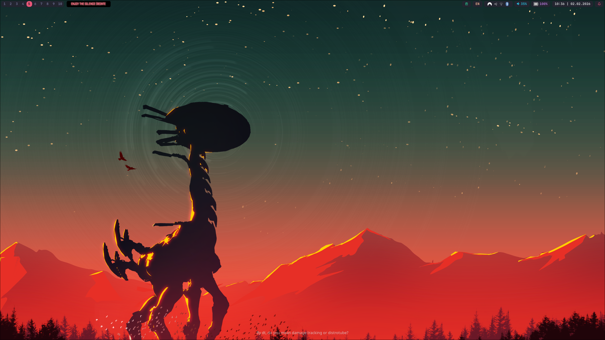

# Dotfiles

## Contents

*   **Hyprland**: Main window manager configuration (`hypr/`).
*   **Fuzzel**: Application launcher (`fuzzel/`).
*   **SwayNC**: Notification center (`swaync/`).
*   **Ironbar**: Status bar (`ironbar/`).

## Structure

The `hypr/` directory is modularized into several configuration files:
*   `hyprland.conf`: Main entry point.
*   `keybindings.conf`: Keyboard shortcuts.
*   `monitors.conf`: Monitor setup.
*   `execs.conf`: Startup applications.
*   `workspaces.conf`: Workspace rules.
*   `colors.conf`: Color scheme.

## Installation

Copy the folders to your `~/.config/` directory.

## Keybindings

| Key Combination | Action |
| :--- | :--- |
| `SUPER + T` | Open Terminal |
| `SUPER + Q` | Kill Active Window |
| `SUPER + W` | Open Zen Browser |
| `SUPER + E` | Open File Manager |
| `SUPER + R` | Open Application Menu |
| `SUPER + V` | Toggle Floating Window |
| `SUPER + L` | Open Power Menu |
| `SUPER + SHIFT + S` | Screenshot (Region) |
| `SUPER + Arrows` | Move Focus |
| `SUPER + S` | Toggle Special Workspace |
| `SUPER + ALT + T` | Change Theme |
| `SUPER + M` | Exit Hyprland |
